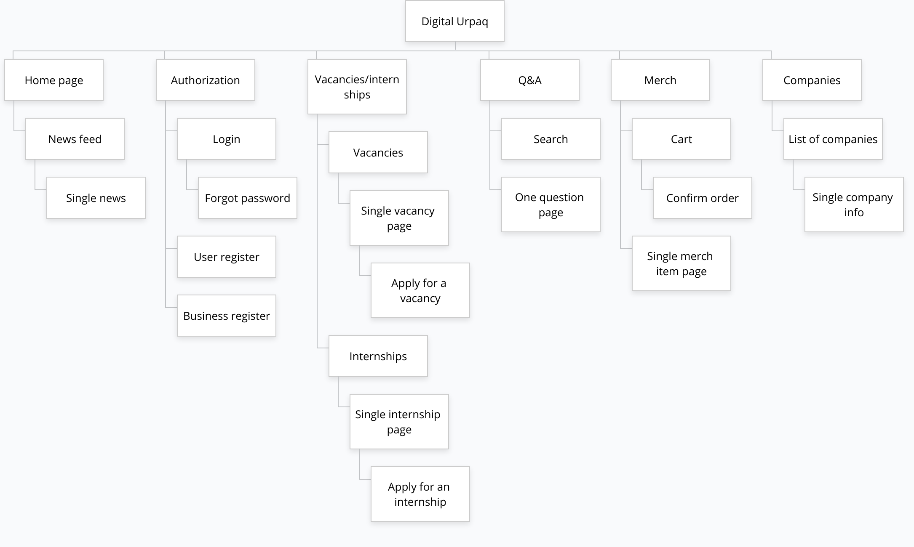
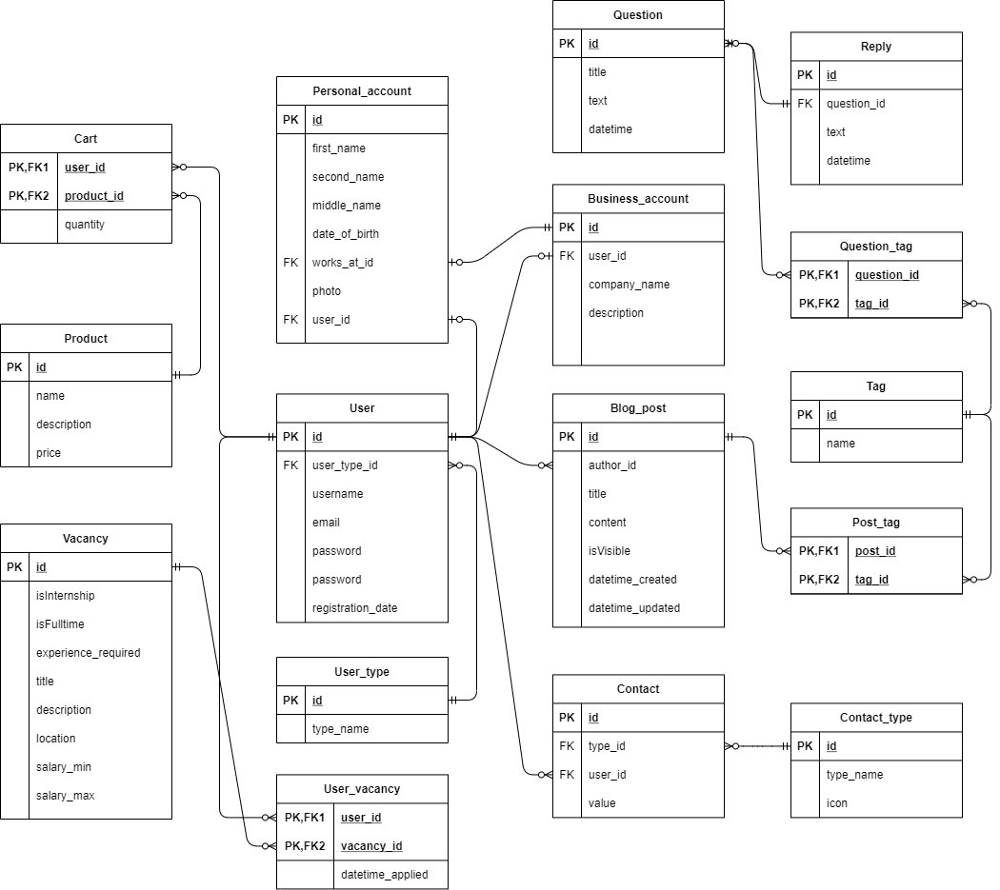

# Digital Urpaq

Group Project for coding lab course.

Project Title: “Digital Urpaq” IT-community website
 
Students:
* Mendigali Temir
* Domolakova Tolkyn
* Shukayeva Kundyz

Group name: Digital Urpaq

Tutor name: Salkenov Aldiyar

Date:  xx-xx-2021

Nur-Sultan 2021

## Introduction
Kazakhstan is considered a young developing country, where IT content is only gaining momentum. As Nathan Rothschild said, " Whoever owns information owns the world." This is what formed the idea to create a platform with the necessary data on information technologies and everything related to them in the modern world, which in due time will be available to all residents of Kazakhstan and not only. Technopark is a service complex designed for the development and implementation of innovative projects through the provision of technological business incubation services, material, and technical support for users.
## Project goals
The aim of the project is the creation of a technology park, which includes the organization and conducting of educational events and courses for training, retraining, and advanced training in the form of courses, seminars, and workshops with the involvement of specialists in the field of IT, giving possible jobs, the implementation of the proposed start-up projects and attract investors, it is also possible to buy merch. The project will focus on the development of technology start-ups and improving the culture of innovation in Kazakhstan.
## Project relevance
The project, called DIGITAL URPAQ, creates favorable conditions for the formation of innovative activities. This website can help many professionals find their place in the IT world. Beginners and those, who already have experience, can improve their skills with the help of the provided courses. What is relevant to our site is that the user can find the information they need without leaving the vastness of one site. Thus, it will contribute to the transition of the economy to an innovative type of development.
## Target audience
The information will be available to everyone who wants to become a part of the innovation community of Kazakhstan. Anyone can get the opportunity to develop their IT startup idea, attracting domestic and foreign investors with their project. Also, domestic IT companies, experts and mentors will be involved in the development of corporate innovations and interaction with young IT companies and the formation of a young generation of entrepreneurs.
## Risk and dependencies
Our project is not unique in Kazakhstan's information technology community. Analogs can be considered the most common and popular technology parks such as AstanaHub and Profit. AstanaHub is an international technology park of IT startups, where conditions are created for the free development of Kazakhstani and foreign technology companies. While Profit provides news from the field of information technology and review materials about different segments of the Kazakhstan IT market. Since these communities are very popular, the risk of our project remaining in the background among others. Perhaps, due to the fact that it will be difficult to promote the site, the attached budget will not pay off.
## Project features
It is planned to create a website that will host current news from the IT world, educational articles, fresh vacancies from employers and various types of advanced training courses. It is also planned to create a question-and-answer section, where specialists in a particular field will answer frequently asked and interesting questions, a window for offering startup ideas and posting it on a public blog to attract investors. Moreover, as a small bonus, users can purchase a personalized sword at affordable prices.
## Design
The website will have 6 main pages: news blog, Q & A section, merch purchase, jobs and internships, courses, and startup ideas. There will be sections with registration and login to the site. It is also planned to create an admin panel that will regulate the operation of the site, add, edit, and delete information.

Picture 1. Digital Urpaq sitemap

## Modeling of the Concept of Database
The analysis of the subject area allows you to build a conceptual model. You need to select entities with their attributes and define semantic relationships between them. An entity is something that needs to be stored in a database. Entities can model specific or abstract concepts. Records about specific parameters of each entity are called attributes.
“ERD or Entity-relationship model, a graphical representation of entities and their relationships to each other, typically used in computing in regard to the organization of data within databases”
## Entity and Attributes
The first step in developing this project was defining the entities that will be stored in the database.
* User
* Blog post
* Merch
* Vacancy
* Question
* Comment
* Cart
## Business rules
* Each blog post can be written by only one user.
* User can buy many merch items.
* User can respond to many vacancies/internships.
* User can create many vacancies/internships.
* User can add many merch items.
* User  can ask many questions.
* User can write many comments.
* User have one and only one cart.
## Attributes 
* Regular users and admin have id,full name, date of birth, gender, phone number,address,email and password.
* Business users have id,the name of the company, phone number,address,email and password.
* Blog posts have post id,title,body,creation date, update date,created by user id.
* Merch item has item id,name,price and description.
* Vacancies/Internships have id,title,description,location,minimum and maximum salary,experience required for this job,information about is this internship or vacancy.
* Question has id,title,text and date time.
* Comment has id,question id,text and date time.
* The cart has a number of products.

Picture 2. Entity relationship diagram

## Project duration
For the implementation of this project, it is planned to spend about 2 months, that is, 8 weeks. The approximate date of the project's readiness is June 14.
Project budget
The following specialists take part in the development of the site: web designer, frontend developer, backend developer. For example, to make a website, you will need to pay for such expenses as a domain name, hosting, SSL, etc.
The concept of the future site, then its development usually begins with the design. A web designer develops logos, banners, and other graphic elements, thinks through site navigation, and determines where to place the text. The planned budget is 150,000 tenge.
Frontend-the developer makes templates for future site pages. Frontend is the code executed in the browser, which is responsible for the display of the site or web application, the performance of all elements on different devices, that is, on the client side. The cost of his work is 250,000 tenge.
The backend developer develops and deploys the server side of web resources, creates the basic logic and architecture of the future web application, and then writes algorithms for its functioning. The work of a backend developer costs 250,000 tenge.
The domain name represents what is typed in the browser before the user can access you, without it it will be impossible to access your site. The cost of a domain name is 4000 tenge per year. To protect sockets and encrypt sensitive information, you will need SSL certificates. The cost of an SSL certificate is 10,000 tenge per year. An equally important part is the site hosting. The cost of the web hosting package is 2000 tenge per month.
The total amount of the estimated budget is 1 million tenge.
## Requirements analysis 
Making a successful website is not an easy thing to do. It will not happen quickly or easily. It will take time, effort, and resources. We need to have a large number of technical skills. For example, we need to know how to program in HTML, CSS, JavaScript, and SQL. In addition to this, it is worth learning the frontend framework React and the backend framework Express. In order to make UI/UX at a very good level we have decided to use Material UI library, which will also need to be studied. Also to create a proper and normalized database we should create an entity relationship diagram and after that move it to the PostgreSQL database using the SQL language. Most of these technologies we learned at the university in the ICT and WEB technologies courses. Also, one of the major ingredients for success is teamwork. We need to divide the roles in the team, stick to the predetermined plan and help each other.

## Team information 
The fact is that web application development involves so many different tasks that it's almost impossible to imagine one person being able to perform each of them professionally. This is why a successful web application development project needs a good team.
Because a web application always has at least two components: a backend and a frontend. In our team, Kundyz takes on the role of a frontend developer. Her job is to program in HTML, CSS, JavaScript and use React js framework together with the Material UI library.
The role of backend developer has been taken by Tolkyn. She will be developing in Node js, using the Express framework and the PostgreSQL database.
Every team needs a leader who will take responsibility for making the most important decisions and pave the way to the team's goal. That role went to Temir. He will be involved in both frontend and backend development.
## Communication strategy 
Now, because of the quarantine, we do not have the opportunity to meet in person. However, we solved this problem and made the meeting online in the discord app. We offer ideas in correspondence, but we discuss them and choose and vote on the best idea during online meetings. After we have chosen an idea, we will continue to discuss how we can improve and implement this idea.
> Github repo https://github.com/mendigali/digital-urpaq
## Project methodology 
We prefer kanban methodology for the project.We chose this method to help our team reduce costs and become more efficient by visualizing and improving workflows. Thanks to the use of the Kanban board, we will improve our workflow. The essence of kanban is to divide the work into tasks and write each of them on cards. Then put the cards on the wall or board. Thus, Kanban will help us to facilitate planning, improve productivity, quality, and reduce production time.  